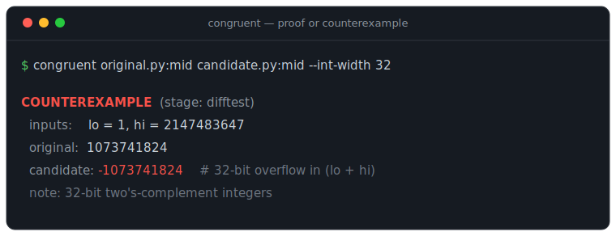

# Congruent

> Given an original function and an AI-rewritten one, **prove** behavioral equivalence within bounds — or return the concrete input that breaks it.

Coding agents refactor, migrate, and "optimize" code constantly. The honest answer to *"did this preserve behavior?"* is usually tests plus vibes. Congruent gives a real answer for a deliberately narrow slice of the problem: **`EQUIVALENT up to bound N`** or **`COUNTEREXAMPLE: <concrete input>`** — no magic in between.

It's equivalence checking (the EDA/formal-methods kind) pointed at the problem of trusting AI-generated code.



---

## Scope (read this first)

The credibility of this tool is its honesty about what it does and doesn't do. v1 is intentionally small.

| In scope (v1) | Out of scope (v1 — see [ROADMAP.md](ROADMAP.md)) |
| --- | --- |
| Pure, deterministic functions (no I/O, no global mutation) | Side effects, I/O, concurrency |
| Bounded inputs: machine ints, bools, fixed-length lists, bounded strings | Floating-point exactness |
| Integer/boolean arithmetic, comparisons, branches | Recursion / function calls; unbounded loops (loops are bounded, unrolled to depth `k`) |
| Bounded loops (`return`/`break`/`continue`), unrolled to depth `k` | Heap aliasing, full object semantics |
| A **Python** subset, plus a **C** subset front end | Full language semantics |

Verdicts:

- **`EQUIVALENT up to bound N`** — no diverging input exists within the bound (proven by the symbolic stage; for the current loop-free subset this is complete over all inputs at the chosen width).
- **`COUNTEREXAMPLE: <input>`** — a concrete input where the two functions disagree, with both outputs.
- **`UNKNOWN`** — no counterexample found, but equivalence not proven (e.g. the symbolic stage declined to model something — see below). Never silently upgraded to `EQUIVALENT`.

Congruent never claims unconditional soundness. Every verdict carries its bound and assumptions.

---

## How it works

Cheap checks first, expensive proof only when needed:

1. **Differential testing** (`difftest.py`) — property-based random + boundary inputs. Kills obvious non-equivalence in milliseconds. A counterexample here ends the run.
2. **Symbolic execution → SMT** (`symbolic.py` + `solver.py`) — translate both functions' bounded behavior into logical constraints, assert *inputs equal ∧ outputs differ*, and ask [Z3](https://github.com/Z3Prover/z3). `UNSAT` = equivalent within bound; `SAT` = the model decodes back to a concrete counterexample.
3. **Bounded model checking** — unroll loops to depth `k`, verify up to that bound, report the bound. (Recursion / function calls are out of scope.)

```
input: fn_original, fn_candidate (source) + bound config
  ├─ parse → normalized typed IR        (ir.py)
  ├─ Stage 1: differential tester ──► counterexample? ─► REPORT   (difftest.py)
  ├─ Stage 2: symbolic engine                                     (symbolic.py)
  │     • symbolically execute each fn over fresh symbolic inputs
  │     • collect path constraints + output expressions
  │     • build (inputs equal) ∧ (outputs differ) → Z3 solve      (solver.py)
  │           • UNSAT → EQUIVALENT up to bound N
  │           • SAT   → decode model → COUNTEREXAMPLE
  └─ REPORT (verdict, bound, counterexample, solver stats, caveats)  (report.py)
```

---

## The demo it's built to land

An LLM "simplifies" a midpoint calculation:

```python
# original (correct under fixed-width ints)
def mid(lo: int, hi: int) -> int:
    return lo + (hi - lo) // 2

# candidate (AI "simplification")
def mid(lo: int, hi: int) -> int:
    return (lo + hi) // 2
```

Congruent catches it:

```console
$ congruent original.py:mid candidate.py:mid --bound 8 --int-width 32
COUNTEREXAMPLE  (stage: difftest)
  inputs:    lo = 1, hi = 2147483647
  original:  1073741824
  candidate: -1073741824        # 32-bit overflow in (lo + hi)
  note: 32-bit two's-complement integers
```

And it *proves* the honest rewrites correct — distributivity over modular arithmetic, here, via Z3:

```console
$ congruent original.py:f candidate.py:g          # (x+y)*2  vs  x*2 + y*2
EQUIVALENT  (stage: symbolic, 0.00s)
  equivalent up to bound 8
  note: 32-bit two's-complement integers
  note: complete: agree on all 32-bit inputs (no loops to bound)
```

One screenshot of *proof-or-counterexample on a real AI refactor* communicates the whole value.

It also handles bounded loops. A reversed-accumulation refactor is proven equivalent up to the unroll bound:

```console
$ congruent original.py:f candidate.py:g --bound 8   # sum i  vs  sum (n-1-i)
EQUIVALENT  (stage: symbolic, 0.01s)
  equivalent up to bound 8
  note: 32-bit two's-complement integers
  note: holds within bound: loops up to 8 iterations
```

And you can scope the question with a **precondition** — equivalence often only holds on part of the input domain:

```console
$ congruent ident.py:f abs.py:g                  # x  vs  (x if x>=0 else -x)
COUNTEREXAMPLE  (stage: difftest)
  inputs: x = -1                                 # they disagree on negatives
$ congruent ident.py:f abs.py:g --assume 'x >= 0'
EQUIVALENT  (stage: symbolic, 0.00s)
  note: precondition: x >= 0
```

Declare a precondition inline with a leading `assume(...)` in the reference function, or pass `--assume` on the CLI.

And it reasons about `list[int]` inputs — here it proves a hand-written count equals `len`, for every list up to the length bound:

```console
$ congruent original.py:f candidate.py:g          # len(xs)  vs  count loop
EQUIVALENT  (stage: symbolic, 0.00s)
  note: holds within bound: lists/strings up to length 8, loops up to 8 iterations
```

> **Status: M0–M7 complete.** The differential stage catches counterexamples
> (overflow included) under a fixed-width integer model; the symbolic stage lowers
> both functions to Z3 bitvector expressions and returns `EQUIVALENT` (UNSAT), a
> `COUNTEREXAMPLE` (SAT, decoded to concrete inputs), or `UNKNOWN`. Supported:
> ints/bools, branches, `for ... in range(...)` and `for x in xs` loops (bounded
> model checking) with `return`/`break`/`continue`, `assume(...)` preconditions, and bounded
> `list[int]` both as inputs (`len`, iteration, `xs[i]`) and as **outputs** (build
> and return a list via literals + `+`), and bounded **`str`** (literals, `len`,
> `==`, `+`, indexing incl. Python negative indices, iteration). Out-of-bounds
> access and divide-by-zero are modeled as runtime errors (a rewrite that crashes
> where the original didn't is a counterexample); *falling off the end without
> returning* yields Python's `None` — a value distinct from both a raised
> exception and any returned value. Counterexamples are minimized to the smallest
> failing input. An optional `--cross-check` re-decides each query with CVC5. Benchmarks
> pass with zero unsound verdicts. See [PROGRESS.md](PROGRESS.md) and
> [ROADMAP.md](ROADMAP.md).

---

## Install

```bash
git clone <repo-url> congruent
cd congruent
python -m pip install -e ".[dev]"
```

Requires Python 3.11+. The solver backend is `z3-solver`.

## Usage

```bash
congruent path/to/original.py:func_name path/to/candidate.py:func_name --bound 8
```

| Flag | Default | Meaning |
| --- | --- | --- |
| `--bound N` | `8` | Loop unroll depth and list/string-length bound |
| `--int-width W` | `32` | Bit width for the fixed-width integer model |
| `--assume EXPR` | — | Precondition on the inputs, e.g. `--assume 'n >= 0'` (repeatable) |
| `--no-minimize` | off | Report the first counterexample found, not the smallest |
| `--cross-check` | off | Re-decide with CVC5 and flag any disagreement (needs `pip install cvc5`) |

## Layout

```
src/congruent/
  ir.py         # Python AST → normalized typed IR
  cfront.py     # C front end (pycparser → the same IR)
  difftest.py   # differential prefilter + fixed-width concrete interpreter (Stage 1)
  symbolic.py   # symbolic interpreter → Z3 exprs (Stage 2)
  solver.py     # equivalence query, model decoding, minimization
  backends.py   # CVC5 cross-check (independent second opinion)
  equiv.py      # orchestration, escalation, Verdict data model
  report.py     # verdict formatting
  cli.py        # `congruent a.py:f b.py:g --bound 8`
tests/          # 154 tests incl. a fuzz soundness guard
examples/       # gallery of realistic AI-refactor pairs (Python + C) + runner
benchmarks/     # recall gate, timing-vs-bound, self-validating fuzzer
docs/demo.svg   # the README demo image
```

## Gallery

[`examples/`](examples/) holds realistic AI-refactor pairs — faithful rewrites
and subtly broken ones — with Congruent's verdict on each (binary-search
midpoint, clamping, list maximum, sum-to-n, counting). Run them all:

```bash
python examples/run_gallery.py
```

## Benchmarks

```bash
python benchmarks/bench_recall.py     # verdict vs. expectation over the eval set
python benchmarks/bench_scaling.py    # solver time vs. --bound
python benchmarks/fuzz.py             # random pairs, each verdict re-checked
```

`bench_recall.py` exits non-zero if any verdict is unsound (a false `EQUIVALENT`
or false `COUNTEREXAMPLE`), so it doubles as a soundness gate. `fuzz.py` is the
deepest check: it generates random function pairs, asks Congruent, and then
*independently re-validates* each verdict against the concrete interpreter — so a
false verdict fails loudly. ~4,900 random pairs (plus Z3↔CVC5 cross-checks) pass
with zero unsound verdicts; a small deterministic batch runs in the test suite.

## Roadmap & progress

- [ROADMAP.md](ROADMAP.md) — milestones M0→M7 and the out-of-scope list as future work.
- [PROGRESS.md](PROGRESS.md) — current state, M0 checklist, and open design decisions.

## License

MIT — see [LICENSE](LICENSE).
